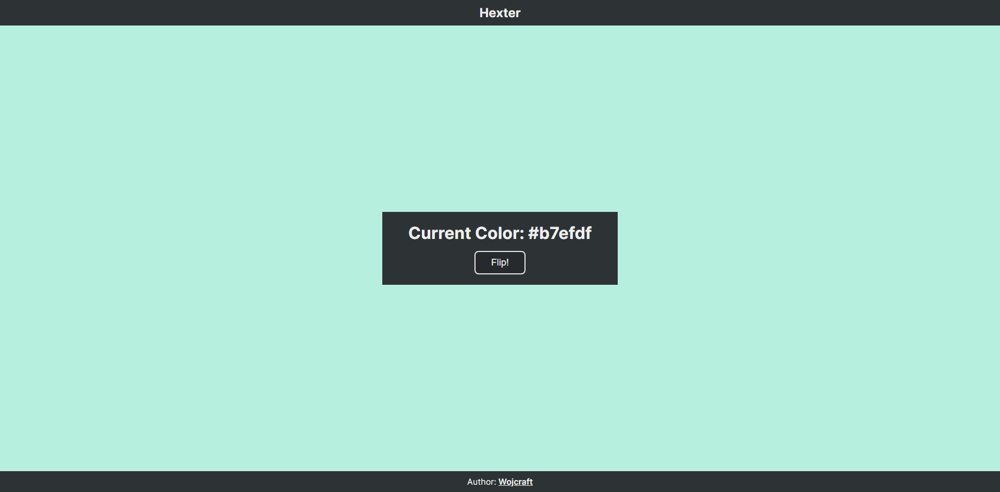

# Hexter

App for generating colors in `hex` format. Built With Vanilla + Vite. Name inspired by TV Cartoon, that I watched for some time when I was about 8 years old.

I built this site to refresh my knowledge (more at [Learnings](#learnings) section).

This is my first project and I've used tutorial from FreeCodeCamp [Video](https://youtu.be/3PHXvlpOkf4?si=PZm8KzwsLHb99DM3&t=422) (Color Flipper Project), but with help of my friend [Marcin](https://github.com/marcin-wosinek), I changed a color generation strategy and wrote a better readme. To note, I made design myself, almost no inspiration

## Preview

[Here](https://wojcraft-hexter.netlify.app) you can see live version. Hosted on Netlify. Below is the screenshot of app's design:

## Technologies

This project uses HTML, CSS & JavaScript along with [Vite](https://vitejs.dev) Build Tool. In this project, there's no framework, because I'm still beginner who wants to have good fundamentals before jumping to Angular or Svelte.

## Learnings

1. I refreshed my knowledge about Vanilla (HTML, CSS & JS), along with Git, ESLint & Prettier.
2. I learned how to convert RGB to Hex.
3. I deployed my one of the first projects to GH Pages, but I switched to Netlify, because it's simpler to use (In my opinion).
